# ELT proces datasetu "Postcode Sector Weather Forecasts"

Tento repozitár ukazuje spôsob implementácie procesu ELT v Snowflake a vytvorenie dátového skladu so schémou Star Schema. Pre náš projekt sme vybrali dátový súbor - **Postcode Sector Weather Forecasts – Sample** . 
Cieľom projektu je vybudovať spoľahlivú analytickú platformu, ktorá transformuje zložité meteorologické údaje na jednoduché a zrozumiteľné ukazovatele pre rozhodovanie v logistike, maloobchode alebo správe mesta.
Vyvinutá architektúra **Star Schema** premieňa surové meteorologické prognózy na štruktúrovaný analytický aktívum.

---
## 1. Úvod a popis zdrojových dát

### 1.1 Prečo práve tento dátový súbor?
Tento dataset používame z nasledujúcich dôvodov:

* **Geopriestorová zložka**: Na rozdiel od bežných tabuliek je tento dataset viazaný na poštové sektory (postcode sectors) a obsahuje súradnice. To umožnilo realizovať analýzu s vysokou presnosťou pre konkrétnu oblasť, a nie len pre mesto.
* **Spoľahlivosť zdroja**: Údaje poskytla Met Office (národná meteorologická služba Spojeného kráľovstva), čo zaručuje ich realistickosť a súlad s priemyselnými štandardmi.
* **Rozmanitosť metrík**: Prítomnosť nielen teploty, ale aj rýchlosti vetra, viditeľnosti a pocitu teploty (feels_like) umožnila vytvoriť rôznorodé vizualizácie a analýzy.
* **Zrozumiteľnosť pre všetkých**: Počasie je téma, ktorá je blízka každému. Každý rozumie, čo je teplota alebo silný vietor, takže výsledky projektu je ľahké vysvetliť aj ľuďom, ktorí nie sú technicky zdatní.
* **Všetko na jednom mieste**: Tu sú čísla (teplota), text (opis počasia) aj geografia (súradnice). To nám umožnilo použiť rôzne analytické nástroje v jednom projekte.

### 1.2 Podporované biznis procesy
Tento projekt poskytuje dáta, ktoré sú kľúčové pre nasledujúce oblasti:

* **Sezónna logika**: je inteligentný obchodný proces realizovaný na základe dátového úložiska, ktorý využíva meteorologické prognózy na optimalizáciu prechodu poľnohospodárskych plodín medzi otvorenou pôdou a chránenými (skleníkovými) podmienkami.
* **Kontrola vysokých vozidiel** (`Wind Risk`): Pomocou `dim_wind_type_key` a funkcie `get_wind_category` systém identifikuje oblasti s kategóriou `Strong` alebo `Gale`. To je kritické pre nákladné vozidlá s vysokou plachtou, ktoré majú vysokú plachtivosť.
* **Optimalizácia nočných jázd**: Prostredníctvom ukazovateľa `visibility_midnight` môže systém automaticky presmerovať nákladné vozidlá na cesty s lepším osvetlením alebo obmedziť rýchlosť v zónach s nízkou viditeľnosťou (hmlistá/silná zrážka).

### 1.3 Ciele

**Cieľom** tohto projektu je analýza predpovedí počasia na úrovni poštových sektorov a vytvorenie dátovej infraštruktúry na:

* **Analýzu miestnych podmienok** (teplota, vietor, viditeľnosť) v konkrétnych oblastiach.
* **Monitorovanie zmien teploty** (teplotný rozdiel) medzi po sebe nasledujúcimi dňami.
* **Kategorizácie rizík súvisiacich s počasím** (napr. silný vietor alebo znížená viditeľnosť).
* **Hľadania zákonitostí a korelácií** v priestorových údajoch v rámci poštových sektorov.

### 1.4 Dátová architektúra
Zdrojom dátového súboru je [Snowflake Marketplace](https://app.snowflake.com/marketplace/listing/GZTDZJKVBD/met-office-postcode-sector-weather-forecasts-sample?search=Weather). Dataset obsahuje tri tabuľky:

* `free_view_daily` - Meteorologické údaje za celý deň
* `free_view_hourly` - Meteorologické údaje za hodinu
* `free_view_three_hourly` - Meteorologické údaje za tri hodiny

Všetky tieto tabuľky sú navzájom prepojené. Každá tabuľka zobrazuje rovnaké údaje, avšak za rôzne časové obdobia. V našom projekte používame práve tabuľku `free_view_daily` a `free_view_hourly. V podstate používame tabuľku „free_view_daily“, pretože práve meteorologické údaje za celý deň sú vhodnejšie na porovnávanie, efektívne sa ukladajú a ideálne sa hodia pre obchodné cykly (logistika, plánovanie objednávok alebo zmien práce) a mnoho ďalších vecí. Tabuľku „free_view_hourly“ používame len na výpočet priemernej dennej teploty.

Cieľom procesu ELT bolo pripraviť, transformovať a sprístupniť tieto údaje na účely multidimenzionálnej analýzy.

### 1.5 Typy údajov

V našom projekte používame rôzne typy údajov, tu je presný zoznam:

* **`NUMBER`** – číselný typ údajov, používa sa pre číselné údaje (rýchlosť vetra, teplota)
* **`FLOAT`** – číselný typ údajov pre podrobnejšie číselné údaje (napr. súradnice)
* **`VARCHAR`** – textový typ údajov, používa sa pre textové údaje (napr. popis typu počasia, názov ročného obdobia)
* **`INT`** – číselný typ údajov, používa sa pre kľúče a dátové hodnoty
* **`DATE`** – dátové údaje, ktoré ukladajú dátum vo formáte: „YYYY-MM-DD“.
* **`TIMESTAMP_NTZ`** – typ údajov, ktorý ukladá čas v presnej podobe bez časového pásma.

---

### **ERD Diagram** 

Surové údaje sú usporiadané v relačnej modeli, ktorá je znázornená na entítno-relačnom diagramu (ERD) nižšie:

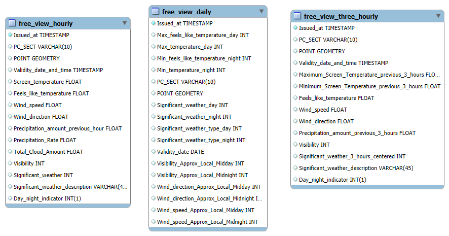

<div align="center">

*Obrazok 1 Entitno-relačná schéma*

</div>


---

## 2. Dimenzionálny model

Používame Star Schema podľa Kimballovej metodológie, ktorá obsahuje 1 tabuľku faktov , ktorá je prepojená s nasledujúcimi 4 dimenziami.

### 2.1 Tabuľka faktov

**fact_weather_forecast**
* **Primárny kľúč (PK)**: `fact_key`,
* **Cudzie kľúče (FK)**:
  * `dim_date_key`
  * `dim_location_key`
  * `dim_weather_type_key`
  * `dim_wind` 
* **Hlavné metriky**:
  * `max_temperature_day` / `max_temperature_night` - denné a nočné maximá.
  * `avg_temperature` — priemerná denná teplota.
  * `max_feels_like_temperature_day` / `min_feels_like_temperature_night` — pocitová teplota.
  * `past_day_temperature_delta` — zmena priemernej teploty v porovnaní s predchádzajúcim dňom.
  * `visibility_midday` / `visibility_midnight` — viditeľnosť na poludnie a o polnoci (dôležité pre dopravu).
  * `wind_speed_midday` / `wind_speed_midnight` — rýchlosť vetra v kľúčových časoch dňa.
  * `wind_direction_midday` / `wind_direction_midnight` — smer vetra.
  * `wind_speed_category` — kategorizácia sily vetra na základe rýchlosti.

### 2.2 Tabuľky dimenzií

**dim_location** 
* **Obsah**: Obsahuje podrobné informácie o lokalite (poštové smerovacie číslo, súradnicovú výšku a šírku).
* **Vzťah k faktom**: 1:N
* **Typ SCD**: Typ 0

**dim_weather_type** 
* **Obsah**: obsahuje informácie o type počasia (jeho kód, popis).
* **Vzťah k faktom**: 1:N
* **Typ SCD**: Typ 0

**dim_date** 
* **Obsah**: obsahuje podrobné informácie o dátume, kedy sa vykonalo meranie a záznam (úplný dátum, deň, deň v týždni, mesiac, rok, štvrťrok a sezóna).
* **Vzťah k faktom**: 1:N
* **Typ SCD**: Typ 0

**dim_wind** 
* **Obsah**: obsahuje úplné informácie o vetre (jeho rýchlosť, smer).
* **Vzťah k faktom**: 1:N
* **Typ SCD**: Typ 0

### 2.3 ERD Diagram
Štruktúra hotového hviezdneho modelu je znázornená na nižšie uvedenom diagramu. Diagram ukazuje vzťahy medzi tabuľkou faktov a dimenziami, čo pomáha ľahšie pochopiť a používať model.

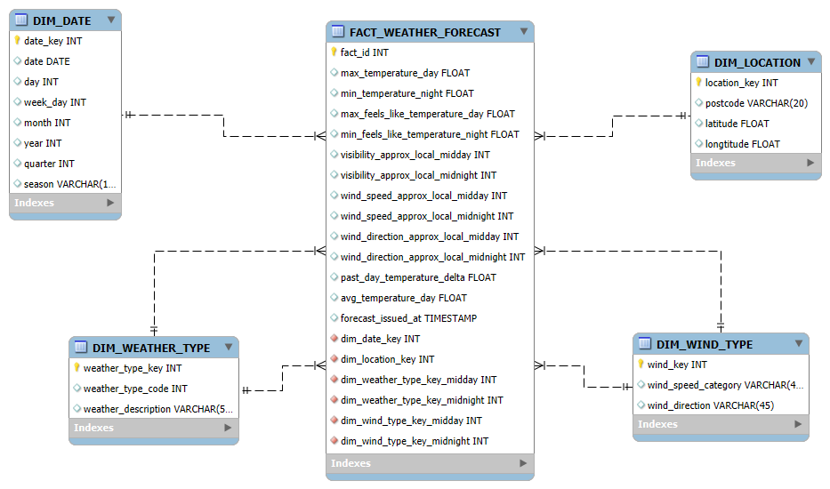

<div align="center">

*Obrazok 2 Schéma hviezdy*

</div>

---
## 3. ELT proces v Snowflake

ETL proces pozostáva z troch hlavných fáz: extrahovanie (Extract), načítanie (Load) a transformácia (Transform). Tento proces bol implementovaný v Snowflake s cieľom pripraviť zdrojové dáta zo staging vrstvy do viacdimenzionálneho modelu vhodného na analýzu a vizualizáciu.

### 3.1 Extract (Extrahovanie dát)

Keďže používame bezplatný dátový súbor zo Snowflake Marketplace, stačí len importovať údaje do našich tabuliek pri vytváraní dočasnej tabuľky. 
Najskôr vytvoríme správnu „štruktúru“ pre našu budúcu tabuľku a vyplníme ju surovými údajmi.
Najprv vykonáme tieto kroky s tabuľkou `STAGING_HOURLY_WEATHER`, pretože túto tabuľku budeme potrebovať na výpočet priemernej teploty:

```SQL
CREATE OR REPLACE TABLE STAGING_HOURLY_WEATHER AS
SELECT 
    "PC_SECT" AS pc_sect,
    "Validity_date_and_time" AS validity_date_and_time,
    "Issued_at" AS issued_at,
    "Screen_temperature" AS screen_temperature,
    "POINT" AS point
FROM POSTCODE_SECTOR_WEATHER_FORECASTS__SAMPLE.PCSECT_FORECAST."free_view_hourly";
```

Ako vidíme, na vyplnenie našej tabuľky používame nasledujúci spôsob: `POSTCODE_SECTOR_WEATHER_FORECASTS__SAMPLE.PCSECT_FORECAST.„free_view_hourly“`
To je náš dátaset. Databáza: `POSTCODE_SECTOR_WEATHER_FORECASTS__SAMPLE`,
schéma: `PCSECT_FORECAST`, tabuľka: `„free_view_hourly”`.

Teraz robíme úplne rovnaké kroky s vytvorením štruktúry a vyplnením údajmi, ale už pre tabuľku `STAGING_DAILY_WEATHER`.

```SQL
CREATE OR REPLACE TABLE STAGING_DAILY_WEATHER AS
SELECT 
    "PC_SECT" AS pc_sect,
    "Validity_date" AS validity_date,
    "Issued_at" AS issued_at,
    "Max_temperature_day" AS max_temperature_day,
    "Min_temperature_night" AS min_temperature_night,
    "Max_feels_like_temperature_day" AS max_feels_like_temperature_day,
    "Min_feels_like_temperature_night" AS min_feels_like_temperature_night,
    "Visibility_Approx_Local_Midday" AS visibility_approx_local_midday,
    "Visibility_Approx_Local_Midnight" AS visibility_approx_local_midnight,
    "Significant_weather_day" AS significant_weather_day,
    "Significant_weather_type_day" AS significant_weather_type_day,
    "Significant_weather_night" AS significant_weather_night,
    "Significant_weather_type_night" AS significant_weather_type_night,
    "Wind_speed_Approx_Local_Midday" AS wind_speed_approx_local_midday,
    "Wind_direction_Approx_Local_Midday" AS wind_direction_approx_local_midday,
    "Wind_speed_Approx_Local_Midnight" AS wind_speed_approx_local_midnight,
    "Wind_direction_Approx_Local_Midnight" AS wind_direction_approx_local_midnight,
    "POINT" AS point
FROM POSTCODE_SECTOR_WEATHER_FORECASTS__SAMPLE.PCSECT_FORECAST."free_view_daily";
```

Cesta je tu presne taká istá, ale tabuľka je už iná. V našom prípade je to teraz `„free_view_daily”`. Práve s touto tabuľkou budeme ďalej pracovať. Práve ona obsahuje „surové” údaje, ktoré potrebujeme.

Ďalej vytvoríme prázdne tabuľky dimenzií, do ktorých budeme v budúcnosti vkladať už pripravené údaje.

`DIM_LOCATION`

```SQL
CREATE OR REPLACE TABLE DIM_LOCATION (
    location_key INT PRIMARY KEY AUTOINCREMENT,
    postcode VARCHAR(20),
    latitude FLOAT,
    longitude FLOAT
);
```
`DIM_WEATHER_TYPE`

```SQL
CREATE OR REPLACE TABLE DIM_WEATHER_TYPE (
    weather_type_key INT PRIMARY KEY AUTOINCREMENT,
    weather_type_code INT,
    weather_description VARCHAR(50)
);
```

`DIM_DATE`

```SQL
CREATE OR REPLACE TABLE DIM_DATE (
    date_key INT PRIMARY KEY, -- Format YYYYMMDD
    date DATE,
    day INT,
    week_day INT,
    month INT,
    year INT,
    quarter INT,
    season VARCHAR(15)
);
```

`DIM_WIND_TYPE`

```SQL
CREATE OR REPLACE TABLE DIM_WIND_TYPE (
    wind_type_key INT PRIMARY KEY AUTOINCREMENT,
    wind_direction VARCHAR(5), -- N, NE, E, SE, S, SW, W, NW, N
    wind_speed_category VARCHAR(15)
);
```

Na samom konci vytvárame už tabuľku faktov `FACT_WEATHER_FORECAST` s konečnou štruktúrou:

```SQL

CREATE OR REPLACE TABLE FACT_WEATHER_FORECAST (
    id INT PRIMARY KEY AUTOINCREMENT,
    
    max_temperature_day NUMBER(6,2),
    min_temperature_night NUMBER(6,2),
    
    avg_temperature_day NUMBER(6,2),
    past_day_temperature_delta NUMBER(6,2),
    
    max_feels_like_temperature_day NUMBER(6,2),
    min_feels_like_temperature_night NUMBER(6,2),
    
    visibility_midday NUMBER(6),
    visibility_midnight NUMBER(6),
    
    wind_direction_midday NUMBER(3),
    wind_direction_midnight NUMBER(3),
    wind_speed_midday NUMBER(6,2),
    wind_speed_midnight NUMBER(6,2),
    
    dim_date_key INT,
    dim_location_key INT,
    dim_weather_type_key_midday INT,
    dim_weather_type_key_midnight INT,
    dim_wind_type_key_midday INT,
    dim_wind_type_key_midnight INT,
    
    forecast_issued_at TIMESTAMP_NTZ 
);
```
---

### Funckie

V našom projekte vytvárame funkcie samostatne, namiesto toho, aby sme ich robili priamo v tabuľkách. Robíme to preto, aby sme v budúcnosti nemuseli do každej tabuľky zapisovať obrovské množstvo textu, čím ušetríme čas a zmenšíme veľkosť nášho kódu. Pri akýchkoľvek zmenách v obchodnej logike (napr. kategória „Strong“ sa zmení z 29 na 30) bude stačiť zmeniť len niekoľko znakov v jednej funkcii. Je to oveľa jednoduchšie a rýchlejšie, ako to meniť v každej tabuľke, kde to používame.
Funkcie sú uvedené nižšie:

`get_wind_direction` - funkcia, ktora funguje ako digitálny kompas. Prijíma azimut v stupňoch (od 0 do 360) a vráti skrátený názov svetovej strany. Rozdelí kruh na 8 sektorov po 45 stupňoch a pomocou CASE priradí konkrétny názov v tabuľke.

```SQL
CREATE OR REPLACE FUNCTION get_wind_direction(deg FLOAT)
RETURNS VARCHAR
LANGUAGE SQL
AS
$$
    CASE 
        WHEN deg >= 337.5 OR deg < 22.5 THEN 'N'
        WHEN deg >= 22.5 AND deg < 67.5 THEN 'NE'
        WHEN deg >= 67.5 AND deg < 112.5 THEN 'E'
        WHEN deg >= 112.5 AND deg < 157.5 THEN 'SE'
        WHEN deg >= 157.5 AND deg < 202.5 THEN 'S'
        WHEN deg >= 202.5 AND deg < 247.5 THEN 'SW'
        WHEN deg >= 247.5 AND deg < 292.5 THEN 'W'
        WHEN deg >= 292.5 AND deg < 337.5 THEN 'NW'
        ELSE 'Unknown'
    END
$$;
```

`get_wind_category` - funkcia, ktora klasifikuje silu vetra na základe jeho rýchlosti. Je to zjednodušená verzia Beaufortovej stupnice. Skupinuje nepretržité číselné hodnoty rýchlosti do pevných diskrétnych kategórií.

```SQL
CREATE OR REPLACE FUNCTION get_wind_category(speed FLOAT)
RETURNS VARCHAR
LANGUAGE SQL
AS
$$
    CASE 
        WHEN speed < 11 THEN 'Light'
        WHEN speed BETWEEN 11 AND 28 THEN 'Moderate'
        WHEN speed BETWEEN 29 AND 49 THEN 'Strong'
        ELSE 'Gale'
    END
$$;
```
---

### 3.2 Load (Načítanie dát)

Po vytvorení všetkých tabuliek konečne prejdeme k fáze Load. Práve v tejto fáze už surové údaje transformujeme do architektúry **Star Schema**, vyplňujúc tabuľky dimenzií.

V tabuľke `DIM_LOCATION` sa extrahujú jedinečné poštové smerovacie čísla. Pomocou funkcií ST_X a ST_Y sa geografický bod (POINT) rozdelí na dĺžku a šírku:

```SQL
INSERT INTO DIM_LOCATION (postcode, longitude, latitude)
SELECT DISTINCT 
    pc_sect AS postcode,
    ST_X(point) AS longitude,
    ST_Y(point) AS latitude
FROM STAGING_DAILY_WEATHER;
```

V tabuľke `DIM_DATE` sa vytvára kalendár. Pre každý dátum sa vypočíta rok, mesiac, štvrťrok a určí sa sezóna (zima, jar atď.) pomocou konštrukcie CASE:

```SQL
INSERT INTO DIM_DATE (date_key, date, day, month, year, quarter, season)
SELECT DISTINCT 
    TO_NUMBER(TO_CHAR(validity_date, 'YYYYMMDD')) AS date_key,
    validity_date AS date,
    DAY(validity_date) AS day,
    MONTH(validity_date) AS month,
    YEAR(validity_date) AS year,
    QUARTER(validity_date) AS quarter,
    CASE 
        WHEN MONTH(validity_date) IN (12, 1, 2) THEN 'Winter'
        WHEN MONTH(validity_date) IN (3, 4, 5) THEN 'Spring'
        WHEN MONTH(validity_date) IN (6, 7, 8) THEN 'Summer'
        ELSE 'Autumn'
    END AS season
FROM STAGING_DAILY_WEATHER;
```

V tabuľke `DIM_WEATHER_TYPE` sa zhromažďujú jedinečné kódy počasia a ich popisy z oboch stĺpcov (deň a noc) prostredníctvom UNION:

```SQL
INSERT INTO DIM_WEATHER_TYPE (weather_type_code, weather_description)
SELECT DISTINCT significant_weather_day, significant_weather_type_day FROM STAGING_DAILY_WEATHER
UNION
SELECT DISTINCT significant_weather_night, significant_weather_type_night FROM STAGING_DAILY_WEATHER;
```

V tabuľke `DIM_WIND_TYPE` sa tu používajú naše funkcie, ktoré sme vytvorili skôr. Systém vezme surové údaje o vetre, prejde ich cez get_wind_direction a get_wind_category a uloží jedinečné kombinácie (napríklad „N“ + „Light“):

```SQL
INSERT INTO DIM_WIND_TYPE (wind_direction, wind_speed_category)
WITH All_Wind_Data AS (
    SELECT wind_direction_approx_local_midday as deg, wind_speed_approx_local_midday as speed FROM STAGING_DAILY_WEATHER
    UNION ALL
    SELECT wind_direction_approx_local_midnight as deg, wind_speed_approx_local_midnight as speed FROM STAGING_DAILY_WEATHER
)
SELECT DISTINCT
    get_wind_direction(deg) as direction,
    get_wind_category(speed) as category 
FROM All_Wind_Data;
```
---

### 3.3 Transform (Transformácia dát)

V nižšie uvedenom SQL dotaze vykonávame niekoľko procesov (označených chronologicky):

1. **Hodinová agregácia** (`Hourly_Agregation`): Používame `QUALIFY ROW_NUMBER()`, aby sme vybrali len najnovšie prognózy `issued_at` a ignorovali zastarané údaje. Ďalej sa vypočíta priemerná teplota za deň na základe hodinových záznamov.
2. **Čistenie denných údajov** (`Daily_Clean`): Spojenie denných ukazovateľov s výsledkami hodinovej agregácie. Opätovná deduplikácia na zabezpečenie jedinečnosti záznamov (jedna oblasť – jeden dátum).
3. **Analýza časových radov** (`Daily_With_Lag`): Používa sa okenná funkcia `LAG()` na získanie teploty za predchádzajúci deň. To umožňuje vypočítať ukazovateľ `Temperature Delta` (dynamika zmeny počasia).
4. **Konečné vyhľadávanie a vloženie**: Všetky textové atribúty sa nahradia náhradnými kľúčmi (ID) z tabuliek meraní prostredníctvom `JOIN`. Úplne pripravené údaje sa zapíšu do tabuľky faktov `FACT_WEATHER_FORECAST`.

```SQL
INSERT INTO FACT_WEATHER_FORECAST (
    max_temperature_day, min_temperature_night, 
    avg_temperature_day,
    past_day_temperature_delta, 
    max_feels_like_temperature_day, min_feels_like_temperature_night, 
    wind_speed_midday, wind_speed_midnight, wind_direction_midday, wind_direction_midnight,
    visibility_midday, visibility_midnight,
    dim_date_key, dim_location_key, 
    dim_weather_type_key_midday, dim_weather_type_key_midnight,
    dim_wind_type_key_midday, dim_wind_type_key_midnight,
    forecast_issued_at
)
-- Deduplicating hour forecasts
WITH Hourly_Deduped AS (
    SELECT * 
    FROM STAGING_HOURLY_WEATHER
    QUALIFY ROW_NUMBER() OVER (PARTITION BY pc_sect, validity_date_and_time ORDER BY issued_at DESC) = 1
),
-- Agregating hour forecasts
Hourly_Agregation AS (
    SELECT 
        DATE(validity_date_and_time) AS v_date,
        pc_sect,
        ROUND(AVG(screen_temperature), 2) AS daily_avg
    FROM Hourly_Deduped
    GROUP BY v_date, pc_sect
),
-- Deduplicating daily forecasts
Daily_Deduped AS (
    SELECT * 
    FROM STAGING_DAILY_WEATHER
    QUALIFY ROW_NUMBER() OVER (PARTITION BY pc_sect, validity_date ORDER BY issued_at DESC) = 1 
),
-- Calculating temperature LAG
Daily_With_Lag AS (
    SELECT 
        dd.*,
        h.daily_avg,
        LAG(h.daily_avg) OVER (PARTITION BY dd.pc_sect ORDER BY dd.validity_date) as prev_avg
    FROM Daily_Deduped dd
    -- Using left join to protect raw data from not inserting if some data was not filled in a right way
    LEFT JOIN Hourly_Agregation h ON dd.validity_date = h.v_date AND dd.pc_sect = h.pc_sect 
)
-- Final Select & Lookup
SELECT 
    dwl.max_temperature_day AS max_temperature_day,
    dwl.min_temperature_night AS min_temperature_night,
    dwl.daily_avg AS avg_temperature_day,
    ABS(dwl.daily_avg - COALESCE(dwl.prev_avg, dwl.daily_avg)) AS past_day_temperature_delta, 
    dwl.max_feels_like_temperature_day AS max_feels_like_temperature_day,
    dwl.min_feels_like_temperature_night AS min_feels_like_temperature_night,
    dwl.wind_speed_approx_local_midday AS wind_speed_approx_local_midday,
    dwl.wind_speed_approx_local_midnight AS wind_speed_approx_local_midnight,
    dwl.wind_direction_approx_local_midday AS wind_direction_approx_local_midday,
    dwl.wind_direction_approx_local_midnight AS wind_direction_approx_local_midnight,
    dwl.visibility_approx_local_midday AS visibility_approx_local_midday,
    dwl.visibility_approx_local_midnight AS visibility_approx_local_midnight,
    TO_NUMBER(TO_CHAR(dwl.validity_date, 'YYYYMMDD')) AS dim_date_key,
    l.location_key AS dim_location_key,
    wtd.weather_type_key AS dim_weather_type_key_midday,
    wtn.weather_type_key AS dim_weather_type_key_midnight,
    wdtm.wind_type_key AS dim_wind_type_key_midday,
    wdtn.wind_type_key AS dim_wind_type_key_midnight,
    dwl.issued_at AS forecast_issued_at
FROM Daily_With_Lag dwl
JOIN DIM_LOCATION l ON dwl.pc_sect = l.postcode
-- Using left join to protect raw data from not inserting if some data was not filled in a right way
LEFT JOIN DIM_WEATHER_TYPE wtd ON dwl.significant_weather_day = wtd.weather_type_code
LEFT JOIN DIM_WEATHER_TYPE wtn ON dwl.significant_weather_night = wtn.weather_type_code
LEFT JOIN DIM_WIND_TYPE wdtm ON 
    wdtm.wind_direction = get_wind_direction(dwl.wind_direction_approx_local_midday) AND 
    wdtm.wind_speed_category = get_wind_category(dwl.wind_speed_approx_local_midday)
LEFT JOIN DIM_WIND_TYPE wdtn ON 
    wdtn.wind_direction = get_wind_direction(dwl.wind_direction_approx_local_midnight) AND 
    wdtn.wind_speed_category = get_wind_category(dwl.wind_speed_approx_local_midnight);
```

Prečo je ten dotaz taký veľký? Zlúčili sme niekoľko dotazov na transformáciu do jedneho veľkeho a tu je dôvod:

* **Výkonnosť** (`Query Optimization`): Cloudová databáza Snowflake „vidí“ celú požiadavku ako celok. Optimalizátor môže lepšie rozdeľovať zdroje, pochopiť, ktoré údaje sú potrebné len raz, a vykonať všetko v operačnej pamäti bez zbytočného zápisu na disk.
* **Atómovosť** (`Data Integrity`): Funguje to ako jedna transakcia. Buď sa všetky údaje spracovali a vložili do tabuľky faktov, alebo sa nič nestalo. Nebude existovať poloprázdna tabuľka. 
* **Úspora miesta a peňazí**: Nevytvárate dočasné tabuľky (TEMP TABLES), ktoré zaberali miesto v úložisku a vyžadovali samostatné príkazy na odstránenie.
* **Kontext LAG a okenných funkcií**: Funkcie ako LAG vyžadujú zoradený a čistý súbor údajov. Použitie CTE umožňuje pripraviť tento ideálny súbor „za behu“.

Po úspešnom nahratí údajov do tabuľky môžeme bez obáv odstrániť dočasné tabuľky, aby sme optimalizovali využitie úložiska:

```SQL
DROP TABLE IF EXISTS STAGING_HOURLY_WEATHER;
DROP TABLE IF EXISTS STAGING_DAILY_WEATHER;
```

---

## 4. Vizualizácia dát

Dashboard obsahuje **`10 vizualizácií`**, ktoré poskytujú základný prehľad kľúčových ukazovateľov a trendov, ktoré ovplyvňujú počasie ako celok (teplota, pocitová teplota, vietor atď.). Tieto vizualizácie poskytujú odpovede na dôležité otázky a umožňujú pochopiť správanie počasia v každom regióne samostatne. Podrobnejšie informácie o každej vizualizácii nájdete nižšie.

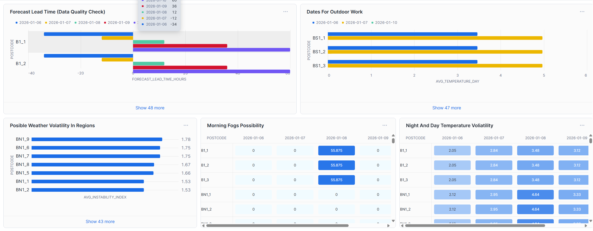
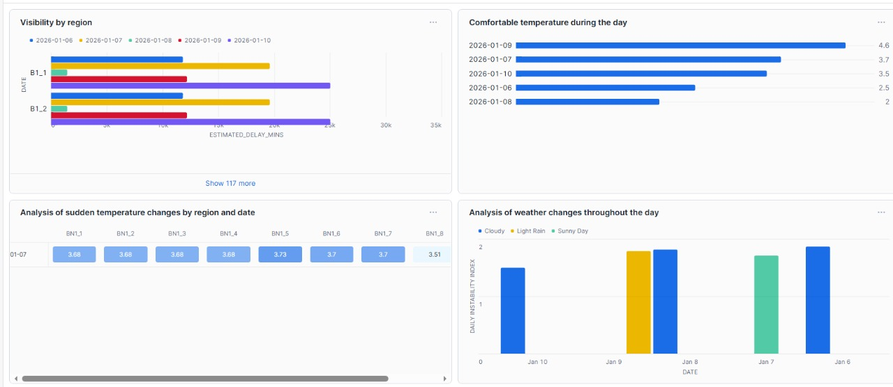
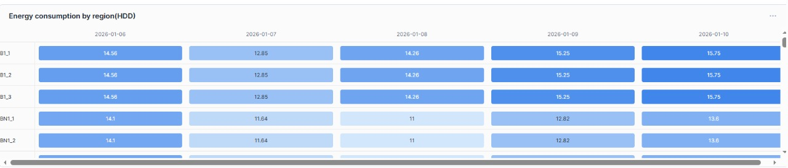
<div align="center">

Obrazok 3 Dashboardy datasetu

</div>

---

### 4.1 Graf 1: Forecast Lead Time (Data Quality Check)

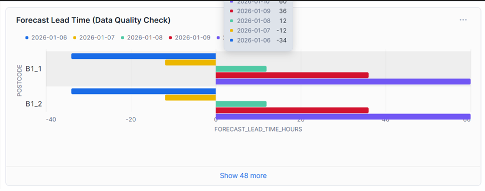

Táto vizualizácia ukazuje oneskorenie medzi časom prognózy a časom, na ktorý bola vydaná. To nám pomôže pochopiť, ako „čerstvé“ sú údaje v našej tabuľke. Ak je zvyčajné oneskorenie 24 a dnes bude 48, znamená to, že proces načítavania údajov sa pokazil alebo že API sa už neaktualizuje.

```SQL
SELECT 
    l.postcode,
    f.forecast_issued_at,
    d.date,
    DATEDIFF('hour', f.forecast_issued_at, d.date) as forecast_lead_time_hours
FROM FACT_WEATHER_FORECAST f
JOIN DIM_LOCATION l ON f.dim_location_key = l.location_key
JOIN DIM_DATE d ON f.dim_date_key = d.date_key
ORDER BY forecast_lead_time_hours DESC;
```

### 4.2 Graf 2: Dates For Outdoor Work

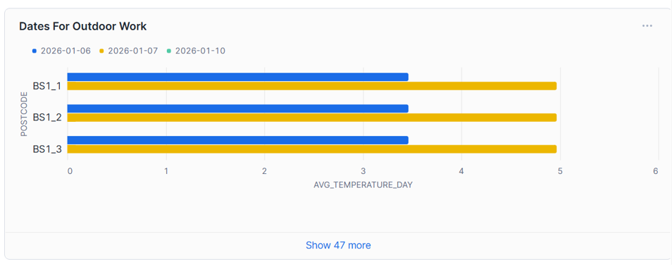

Táto vizualizácia nám ukazuje dni, v ktorých sa predpokladá najlepšie počasie. Medzi výhody patrí:

* **Optimalizácia zdrojov**: Manažér vidí zoznam poštových smerovacích čísel a dátumov, kedy budú podmienky ideálne. Na tieto dni je možné naplánovať maximálny počet výjazdov alebo opravných prác na streche.
* **Marketing a zákaznícka skúsenosť**: Pre doručovateľské spoločnosti sú to dni, kedy je možné zaručiť „najrýchlejšie doručenie“, pretože riziko meškaní kvôli počasiu je minimálne.

```SQL
SELECT 
    l.postcode, 
    d.date,
    f.avg_temperature_day,
    wd.wind_speed_category,
    wt.weather_description
FROM FACT_WEATHER_FORECAST f
JOIN DIM_LOCATION l ON f.dim_location_key = l.location_key
JOIN DIM_DATE d ON f.dim_date_key = d.date_key
JOIN DIM_WEATHER_TYPE wt ON f.dim_weather_type_key_midday = wt.weather_type_key
JOIN DIM_WIND_TYPE wd ON f.dim_wind_type_key_midday = wd.wind_type_key
WHERE wt.weather_description LIKE '%Clear%' OR wt.weather_description LIKE '%Partly Cloudy%'
  AND wd.wind_speed_category = 'Light'
  AND f.visibility_midday > 10000
ORDER BY d.date;
```

### 4.3 Graf 3: Posible Weather Volatility in Regions

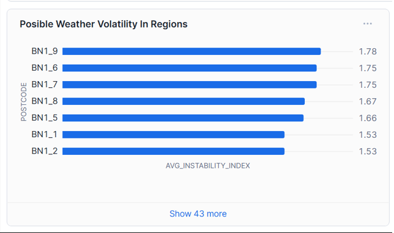

Táto vizualizácia zobrazuje regióny s najdynamickejšími zmenami poveternostných podmienok. Používame vypočítaný index nestability, ktorý môže byť užitočný pre prevádzkových manažérov pri identifikácii oblastí, kde má predpoveď najvyššiu mieru neistoty.

```SQL
SELECT 
    l.postcode,
    ROUND(AVG(f.past_day_temperature_delta), 2) AS avg_instability_index,
    COUNT(DISTINCT f.dim_weather_type_key_midday) AS unique_weather_types_seen,
    MAX(f.past_day_temperature_delta) AS peak_temperature_swing
FROM FACT_WEATHER_FORECAST f
JOIN DIM_LOCATION l ON f.dim_location_key = l.location_key
GROUP BY l.postcode
HAVING COUNT(*) >= 4 
ORDER BY avg_instability_index DESC;
```

### 4.4 Graf 4: Morning Fogs Possibility

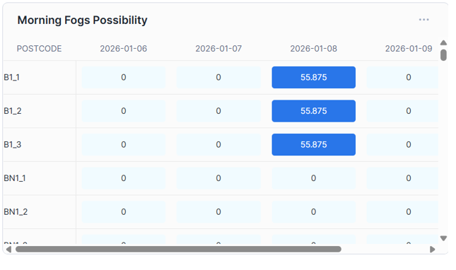

Vizualizácia analyzuje kombináciu nízkej viditeľnosti a nízkej rýchlosti vetra v nočných hodinách na výpočet pravdepodobnosti vzniku hustej hmly. To môže byť užitočné v logistike, napríklad pre doručovateľské spoločnosti. Aby sa predišlo meškaniam alebo nehodám, spoločnosti budú vopred plánovať čas cesty.

```SQL
SELECT 
    l.postcode, 
    d.date,
    f.visibility_midnight,
    f.wind_speed_midnight,
    CASE 
        WHEN f.visibility_midnight < 500 AND wd.wind_speed_category = 'Light' 
            THEN 2 -- High Risk
        
        WHEN f.visibility_midnight < 1000 
            THEN 1 -- Moderate Risk
            
        ELSE 0 
    END AS fog_probability_pct
FROM QUAIL_DB.UKF_PROJECT.FACT_WEATHER_FORECAST f
JOIN DIM_LOCATION l ON f.dim_location_key = l.location_key
JOIN DIM_DATE d ON f.dim_date_key = d.date_key
JOIN QUAIL_DB.UKF_PROJECT.DIM_WIND_TYPE wd ON wd.wind_type_key = f.dim_wind_type_key_midnight
WHERE f.visibility_midnight < 1000;
```

### 4.5 Graf 5: Night And Day Temperature Voliatility

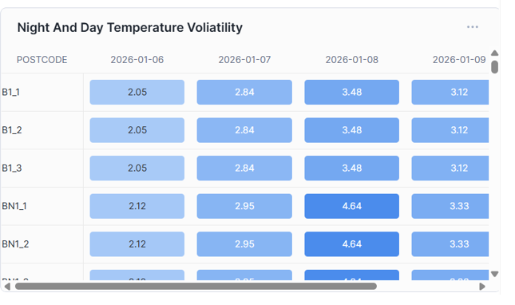

Táto vizualizácia analyzuje dennú amplitúdu teploty – rozdiel medzi najvyššou teplotou počas dňa a najnižšou teplotou v noci. Je to jeden z najdôležitejších ukazovateľov na posúdenie „prísnosti“ podnebia v konkrétnom období. 

* **Energetika a bývanie** : Je to kritické pre systémy automatického kúrenia. Veľká amplitúda znamená, že systém musí byť veľmi flexibilný: cez deň sa takmer vypínať a v noci pracovať na plný výkon.
* **Cestná infraštruktúra ('efekt „zmrazenia-rozmrazenia'”)**: Ak je teplota cez deň vyššia a v noci nižšia, vedie to k rýchlemu poškodeniu asfaltu a tvorbe námrazy ráno. Pre cestné služby je to signál „žltého poplachu”.
* **Poľnohospodárstvo: Veľké teplotné výkyvy ('tepelný stres')**: ovplyvňujú zdravie zvierat a stav rastlín v skleníkoch.

```SQL
SELECT 
    l.postcode, 
    d.date,
    f.max_temperature_day,
    f.min_temperature_night,
    (f.max_temperature_day - f.min_temperature_night) AS temp_amplitude
FROM FACT_WEATHER_FORECAST f
JOIN DIM_LOCATION l ON f.dim_location_key = l.location_key
JOIN DIM_DATE d ON f.dim_date_key = d.date_key;
```

### 4.6 Graf 6: Visibility by region

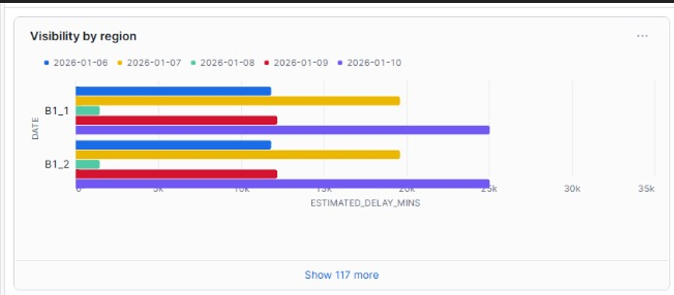

Vizualizácia umožňuje porovnávať podmienky viditeľnosti v rôznych poštových sektoroch v reálnom čase. Systém automaticky triedi údaje tak, aby analytik ako prvý videl regióny s potenciálne nebezpečnými podmienkami (hmlou alebo silnými zrážkami), čo zabezpečuje rýchle rozhodovanie v logistike.

```SQL
SELECT 
    d.date, 
    l.postcode, 
    ROUND(AVG(f.visibility_midday), 0) as avg_visibility_meters
FROM FACT_WEATHER_FORECAST f
JOIN DIM_LOCATION l ON f.dim_location_key = l.location_key
JOIN DIM_DATE d ON f.dim_date_key = d.date_key
GROUP BY 1, 2
ORDER BY 1 DESC, 3 ASC;
```

### 4.7 Graf 7: Comfortable temperature during the day

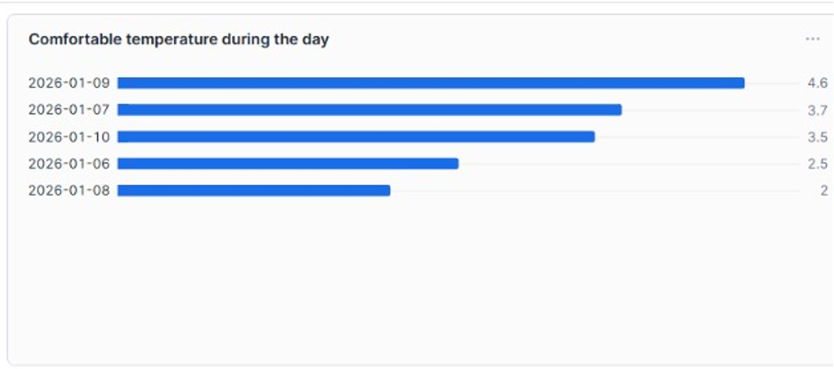

Táto vizualizácia analyzuje rozdiel medzi skutočnou a vnímanou teplotou. 
Ľudia prijímajú rozhodnutia (kúpiť kávu, objednať si donášku alebo ísť do obchodu) práve na základe „pocitov“. Vysoký `Chill factor` zvyčajne znižuje peší pohyb.

```SQL
SELECT 
    d.date, 
    ROUND(AVG(f.max_temperature_day - f.max_feels_like_temperature_day), 1) as daily_chill_factor
FROM FACT_WEATHER_FORECAST f
JOIN DIM_DATE d ON f.dim_date_key = d.date_key
GROUP BY d.date
ORDER BY d.date ASC;
```

### 4.8 Graf 8:

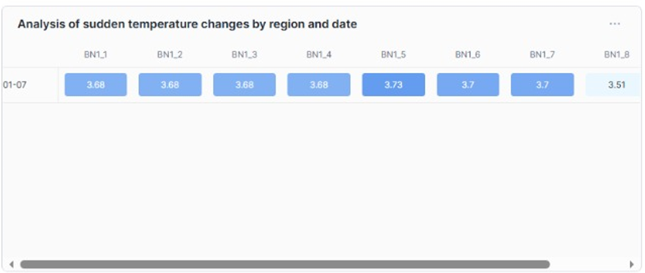

Táto vizualizácia umožňuje identifikovať oblasti tepelného stresu. Dotaz identifikuje prípady, keď denná zmena teploty prekročí prah 3,5 °C. To umožňuje prevádzkovým službám vopred pripraviť infraštruktúru na možné riziká kondenzácie alebo náhlej zmeny zaťaženia energetickej siete.

```SQL
SELECT 
    TO_TIMESTAMP(d.date) as date_x, 
    l.postcode, 
    f.avg_temperature_day, 
    f.past_day_temperature_delta
FROM FACT_WEATHER_FORECAST f
JOIN DIM_LOCATION l ON f.dim_location_key = l.location_key
JOIN DIM_DATE d ON f.dim_date_key = d.date_key
WHERE f.past_day_temperature_delta > 3.5
ORDER BY d.date ASC;
```

### 4.9 Graf 9: 

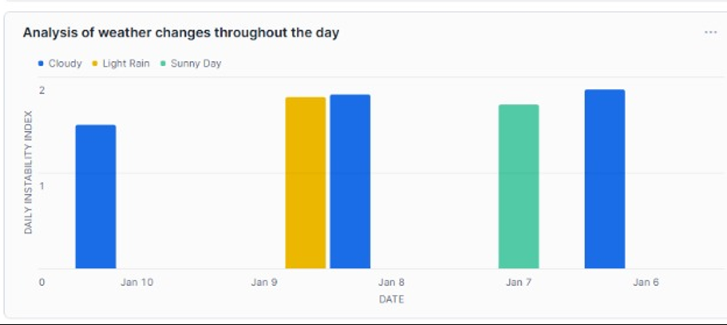

Vizualizácia porovnáva denné a nočné poveternostné podmienky na výpočet indexu dennej variability. Umožňuje odlíšiť dni so stabilným klimatickým pozadím od dní s prudkými zmenami poveternostných fáz, čo je kritické pre krátkodobé operačné plánovanie.

Táto vizualizácia pomáha posúdiť predvídateľnosť prevádzkového prostredia:

* **Práca technických služieb**: Vysoká premenlivosť znamená zaťaženie odtokových a osvetľovacích systémov. Ak sa počasie často mení, automatika pracuje v režime neustáleho prepínania, čo urýchľuje opotrebovanie zariadení.
* **Marketing**: Je to ideálny ukazovateľ pre `„dynamický marketing“`. Napríklad, ak je index stabilne vysoký, je to vhodný čas na reklamu tovarov `„do každého počasia“` (dáždniky, sezónne oblečenie).

```SQL
SELECT 
    d.date, 
    AVG(CASE 
        WHEN dwd.weather_description = dwn.weather_description THEN 1 
        ELSE 2 
    END) AS daily_instability_index,
    MODE(dwd.weather_description) AS main_day_weather
FROM FACT_WEATHER_FORECAST f
JOIN DIM_DATE d ON f.dim_date_key = d.date_key
JOIN DIM_WEATHER_TYPE dwd ON f.dim_weather_type_key_midday = dwd.weather_type_key
JOIN DIM_WEATHER_TYPE dwn ON f.dim_weather_type_key_midnight = dwn.weather_type_key
GROUP BY d.date
ORDER BY d.date ASC;
```

## 4.10 Graf 10: Energy consumption by region (HDD)


Konečná vizualizácia integruje ukazovateľ `HDD` s geografickými údajmi `(PSČ)`. To umožňuje transformovať poveternostné podmienky na konkrétne prevádzkové náklady, čím sa vytvára základ pre presné prognózovanie rozpočtu spotreby energie v každom regióne prítomnosti. Namiesto toho, aby spoločnosť vynakladala rovnakú sumu na vykurovanie všetkých skladov, môže rozdeľovať prostriedky proporcionálne k `HDD` každého poštového smerovacieho čísla.

```SQL
WITH stats AS (
    SELECT AVG(18 - max_temperature_day) as avg_hdd
    FROM FACT_WEATHER_FORECAST
)
SELECT 
    l.postcode,
    d.date,
    CASE 
        WHEN f.max_temperature_day < 18 THEN (18 - f.max_temperature_day)
        ELSE 0 
    END AS heating_degree_days,
    f.past_day_temperature_delta
FROM FACT_WEATHER_FORECAST f
JOIN DIM_DATE d ON f.dim_date_key = d.date_key
JOIN DIM_LOCATION l ON f.dim_location_key = l.location_key
ORDER BY heating_degree_days DESC;
```

## 5 Výsledky práce

Dokončenie projektu preukázalo úspešnú implementáciu kompletného cyklu **`ELT`** v cloudovom prostredí **`Snowflake`**. Vytvorená analytická platforma premieňa surové meteorologické údaje na strategický aktívum pre podnikanie, čo umožňuje prijímať rozhodnutia na základe objektívnych ukazovateľov, a nie predpokladov.

### 5.1 Obchodná hodnota a praktické využitie

Vďaka vyvinutej architektúre **`Star Schema`** a zavedeniu špecializovaných metrík projekt zabezpečuje riešenie konkrétnych obchodných úloh:

* **Energetická efektívnosť a rozpočtovanie**: Využitie ukazovateľa HDD (Heating Degree Days) umožňuje spoločnostiam presne vypočítať náklady na vykurovanie skladov a kancelárií v rôznych regiónoch, čo pomáha optimalizovať prevádzkové rozpočty.
* **Riadenie logistických rizík**: Analýza viditeľnosti a veterného zaťaženia umožňuje vopred korigovať trasy nákladných vozidiel, čím sa minimalizuje pravdepodobnosť meškaní alebo nehôd v dôsledku nepriaznivých poveternostných podmienok (hmlistá, silný vietor).
* **Plánovanie vonkajších prác**: Vytvorené správy pomáhajú identifikovať najstabilnejšie „počasové okná“, čo je kritické pre stavebné, opravárske a poľnohospodárske práce.
* **Monitorovanie klimatických anomálií**: Detekcia teplotných šokov a indexov nestability umožňuje infraštruktúrnym službám rýchlejšie reagovať na náhle zmeny prostredia a predchádzať poškodeniu zariadení.

### 5.2 Technické úspechy

Z technického hľadiska projekt potvrdil účinnosť nasledujúcich prístupov:

* **Optimalizácia ELT**: Zjednotenie zložitých transformácií do jednotných `SQL` dopytov s využitím `CTE` (Common Table Expressions) umožnilo zvýšiť produktivitu spracovania a znížiť náklady na zdroje **`Snowflake`**.
* **Flexibilita prostredníctvom funkcií (UDF)**: Presunutie logiky klasifikácie vetra a smeru do samostatných funkcií zabezpečilo modularitu kódu a jednoduchosť vykonávania zmien v obchodnej logike.
* **Kvalita údajov**: Zavedenie kontrol **„čerstvosti“** prognóz **`(Lead Time)`** zaručuje spoľahlivosť analýzy a umožňuje včas odhaliť poruchy v dodávaní údajov.

### 5.3 Zhrnutie

Vyvinutý systém je škálovateľným riešením, ktoré sa ľahko prispôsobuje potrebám logistiky, maloobchodu alebo správy mestskej infraštruktúry. Dokazuje, že integrácia externých meteorologických údajov do internej analýzy spoločnosti je kľúčom k zvýšeniu bezpečnosti a finančnej stability v podmienkach meniaceho sa klímy.

---

**Autori:** **`Anatolii Lyrchykov`**, **`Yevhenii Prasol`**

